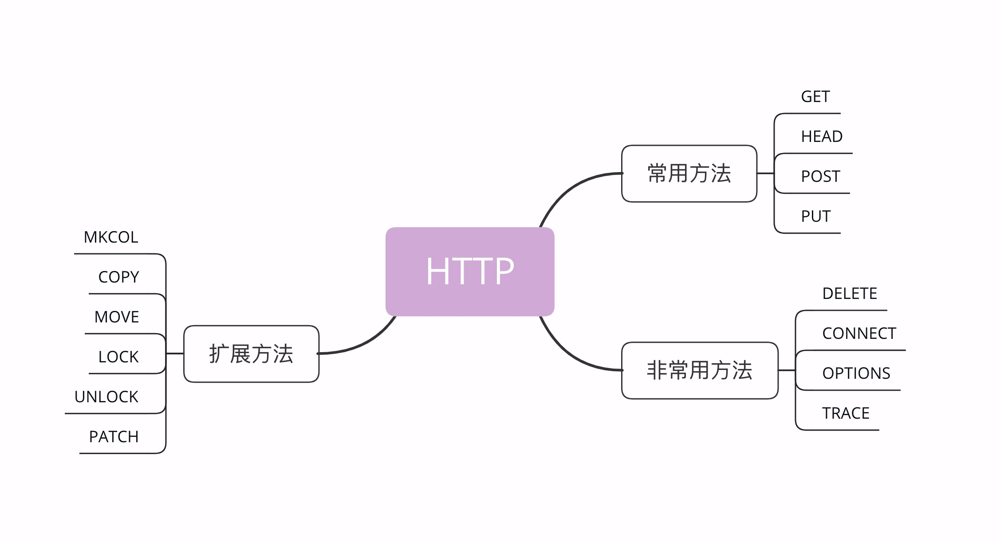

**HTTP**

超文本传输协议

专门用来在两点之间传输数据的约定和规范

双向协议:
	服务器---->客户端
	客户端---->服务器

服务器可以当客户端

**特点**

1. `HTTP`最大的优点是简单,灵活和易于扩展;
2. `HTTP`拥有成熟的软硬件环境,应用的非常广泛,是互联网的基础设施;
3. `HTTP`是无状态的,可以轻松实现集群化,扩展性能,但有时也需要用`Cookice`技术来实现**有状态**
4. `HTTP`是明文传输,数据完全肉眼可见,能够方便地研究分析,但也容易被窃听
5. `HTTP`是不安全的,无法验证通信双方的身份,也不能判断报文是否被篡改
6. `HTTP`的性能不算差,但不完全适应现在的互联网,还有很大的提升空间

**TCP/IP**

TCP输入**传输层**,IP属于**网际层**

**IP**主要是解决寻址和路由问题,以及如何在两点间传送数据包

**TCP**传输控制协议,它文艺IP协议之上,基于IP协议提供**可靠**的,**字节流**形式的通信,是HTTP协议得以实现的基础

**解释:**

1. **可靠**:是指保证数据不丢失

2. **字节流**:是保证数据完整	


**DNS**

域名系统,用有意义的名字来作为IP地址的等价替代

用`.`分隔,级别从左到右逐级升高,最右边被称为定级域名,如:`com`

**域名解析**

​	想要使用`TCP/IP`协议来通信仍然要使用`IP`地址,所以需要把域名做一个转换,映射到它的真实IP,这就是所谓的**域名解析**

​	目前全世界有13组根`DNS`服务器,下面再有需要的定级DNS,权威`DNS`和更小的本地`DNS`,逐层递归地实现域名查询

**URI**

统一资源标识符,使用它就能够唯一的标记互联网上资源	

**URL**

统一资源定位符,它实际上是`URI`的一个子集,不过因为这两者几乎是相同的,差异不大,所以通常不会做严格的区分

```js
scheme://host.domain:port/path/filename
```

1. **sheme **

   定义因特网服务的类型 常见的协议有http、https、ftp、file,其中最常见的类型是http,而https则是进行加密的网络传输

2. **host**
   - 定义域主机
   - http的默认主机是www

3. **domain **
   - 定义因特网域名
   - 比如 w3school.com.cn

4. **port** 
   - 定义主机上的端口
   - http的默认端口号是80

5. **path **
   - 定义服务器上的路径
   - 如果省略则文档必须位于网站的根目录中

6. **filename **
   
   - 定义文档、资源的名称

**HTTPS**

​		运行在`SSL/TLS`协议上的HTTP

​		`SSL/TLS`,而不是`TCP/IP`,它是一个负责加密通信的安全协议,建立在`TCP/IP`之上,所以也是个可靠的传输协议,可以被用作`HTTP`的下层

​	**Proxy**	  

​	`HTTP`协议中轻轻方和应答方中间的一个环节,作为**中转站**,既可以转发客户端的请求,也可以转发服务器的应答

**种类:**

1. 匿名代理:完全**隐匿**了被代理的机器,外界看到的知识代理服务器;

2. 透明代理:顾名思义,它在传输过程中是**透明开发**的,外界即知道代理,也知道客户端

3. 正向代理:靠近客户端,代表客户端向服务器发送请求;

4. 反向代理:靠近服务器端,代表服务器影响客户端的请求

   由于代理在传输过程中插入了一个**中间层**,所以可以在这个环节做很多有意思的事情:

1. 负载均衡: 把访问轻轻均匀分散多台机器,实现访问集群化;
2. 内容缓存:暂存上下行的数据,减轻后端的压力;
3. 安全防护: 隐匿IP,使用`WAF`等工具抵御网络攻击,保护被代理的机器;
4. 数据处理: 提供压缩,加密等额外的功能

**TCP/IP网络分层模型**

​	`TCP/IP`协议总共有四层,就像搭积木一样,每一层需要下层的支撑,同时又支撑着上层,任何一层被抽掉都可能会导致整个协议栈坍塌

​		层次顺序是**从下往上**,所以第一层就是最下面的一层


**链接层**	

​	负责在以太网,`WIFI`这样的底层网络上发送原始数据包,工作在网卡这个层次,使用`MAC`地址来标记网络上的设备,所有有时候也叫`MAC`层

**网际层或网络互联层**

​	`IP`协议就处在这一层,因为`IP`协议定义了`IP`地址的概念,所以就可以在**链接层**的基础上,用`IP`地址取代`MAC`地址,把许许多多的局域网,广域网连接成一个虚拟的巨大网络,在这个网络里找设备时只要把`IP`地址再''翻译''成`MAC`地址就可以了

**传输层**

​	这个层次协议的职责时保证数据在`IP`地址标记的两点之间可靠地传输,是TCP协议工作的层次,另外还有它的一个小伙伴`UDP`

​	`TCP` 是一个有状态的协议,需要先于对方建立连接然后才能发送数据,而且保证数据不丢失不重复.而`UDP`则比较简单,它无状态,不用事先建立连接就可以任意发送数据,但不保证数据一定会发到对方,两个协议的另一个重要区别在于数据的形式,`TCP`的数据是连续的字节流,有先后顺序,而`UDP`则是分散的小数据包,是顺序发,乱序收

**应用层**

​	这一层有各种面向具体应用的协议,例如`Telnet`,`SSH`,`FTP`,`SMTP`,`HTTP`等

​	`MAC`层的传输单位是帧(`frame`),`IP`层的传输单位是包(`packet`),`TCP`层的传输单位是段(`segment`),HTTP的传输单位则是消息或报文(`message`).这些名词并没有什么本质的区别,可以统称为数据包


**OSI网络分层模型**

​	开放式系统互联通信参考模型	

​	`TCP/IP`发明于1970年,当时除了它还有很多其他网络协议,整个网络世界比较混乱,这个时候忘记组织`ISO`注意到了这种现象,想要大一统,于是设计出了一个新的网络分层模型,想用这个新框架来统一既存的各种网络协议

​	`OSI`模型分成了七层,部分层次于`TCP/IP`很像,从下到上分别是:


1. 物理层`physical`	网络的物理形式,如:电缆 光纤 网卡 集线器等	
2. 数据链路层`link`     基本相当于`TCP/IP`的链接层,提供介质访问和链路管理`MAC`
3. 网络层`network`    相当于`TCP/IP`里的网际层,ip选址及路由选择`IP`
4. 传输层`transport`     相当于`TCP/IP`里的传输层,建立,管理和维护端到端的连接`TCP/UDP`
5. 会话层`session`    维护网络中的连接状态,保持回话和同步
6. 表示层`presentation`    数据格式转化,数据加密
7. 应用层`application`    面向具体的应用传输数据

**OSI和TCP/IP区别**	

1. `TCP/IP`是一个纯软件的栈,没有网络应有的最根基的电缆,网卡等物理设备的位置,而OSI则补足了这个缺失,在理论层面上描述网络更加完整
2. `OSI`为每一层标记了明确了编号,最底层是一层,最上层是七层,而`TCP/IP`的层次只有名字而没有编号 

**两个分层模型的映射关系**


1. 第一层 物理层 `TCP/IP`里无对应

2. 第二层 数据链路层 对应`TCP/IP`的链接层

3. 第三层 网络层 对应`TCP/IP`的网际层

4. 第四层 传输层 对应 `TCP/IP`的传输层

5. 第五六七层 统一对应到`TCP/IP`的应用层

   `OSI`的分层模型在四层以上分的太细,而`TCP/IP`实际应用时的回话管理,编码转化,压缩等和具体应用经常联系的很紧密,很难分开,如:HTTP协议就同时包含了连接管理和数据格式定义

**四层负载均衡**

​		在工作在传输层上,基于`TCP/IP`协议的特性,如:`IP`地址,端口号等实现对后端服务器的负载均衡

**七层负载均衡**

​	在应用层上,看到的是`HTTP`协议,解析`HTTP`报文里的`URI`,主机名,资源类型等数据,再用适当的策略转发给后端服务器

**辨别四层和七层**

​	凡是由操作系统负责处理的就是四层或四层以下

​	凡是需要由应用程序(自己写代码)负责处理的就是七层

**TCP/IP协议栈的工作方式**

​	`HTTP`协议的传输过程就是这样通过协议栈逐层向下,每一层都添加本层的专有数据,层层打包,然后通过下层发送出去

​	接收数据是则是相反的操作,从下往上穿过协议栈,逐层拆包,每层去掉本层的专有头,上层就会拿到自己的数据

​	但下层的传输过程对于上层是完全**透明**的,上层也不需要关心下层的具体实现细节,所以就`HTTP`层次来看,它不管下层是不是`TCP/IP`协议,看到的只是一个可靠的传输链路,只要把数据加上自己的头,对方就能原样收到


**报文**

1. `HTTP`报文接口就像是'大头儿子',由'起始行+头部+空行+实体'组成,简单地说就是'header+body'
2. `HTTP`报文可以没有body,但必须要有header,而且header后也必须要有空行,形象说就是'大头'必须要带着'脖子'
3. 请求头由'请求行+头部字段'构成,响应头由'状态行+头部字段'构成
4. 请求行有三部分:请求方法,请求目标和版本号
5. 状态行也有三部分:版本号,状态码和原因字符串
6. 头部字段是`key-value`的形式,用':'分隔,不区分大小写,顺序任意,除了规定的标准头,也可以任意添加自定义字段,实现功能扩展;
7. `HTTP/1.1`里唯一要去必须提供的头字段是`Host`,它必须出现在请求头里,标记虚拟主机名

**常用头字段**

​	基本上可以分为四大类:

1. 通用字段: 在请求头和响应头里都可以出现
2. 请求字段: 仅能出现在请求头里,进一步说明请求信息或者额外的附加条件
3. 响应字段: 仅能出现在相应头里,补充说明相应报文的信息
4. 实体字段: 它实际上属于通用字段,但专门描述body的额外信息

**hosts**

​	只能出现在请求头,唯一一个`HTTP/1.1`规范要去必须出现的字段,如果请求头里没有`Host`,那就是一个错误的报文

​	`Host`字段告诉服务器这个请求也能够给由哪个逐级来处理,当一台计算机上托管了多个虚拟主机的时候,服务器端就需要用`Host`字段来选择,有点像一个简单的路由重定向

**User-Agent**

​	请求字段,只出现在请求头里,它使用一个字符串来描述发起`HTTP`请求的客户端,服务器可以依据它来返回最合适此游览器显示的页面

​	有的爬虫会在`User-Agent`里面用`spider`标明自己是爬虫,所以可以利用这个字段实现简单的反爬虫策略

**Date**

​	通用字段,通常出现在响应头里,表示`HTTP`报文创建的时间,客户端可以使用这个时间再搭配其他字段决定缓存策略

**Server**

​	响应字段,只能出现在响应头里,它告诉客户端当前正在提供`web`服务的软件名称和版本号

​	`server`不是必须要出现的,这会把服务器的一部分信息暴漏给外界,如果存在`bug`,那么黑客就有可能利用`bug`攻陷服务器,所以有的网站响应头里要么没有这个字段,要么就给出一个完全无关的描述信息

​	**Content-Length**

​	报文里`body`的长度,也就是请求头或响应头空行后面数据的长度.服务器看到这个字段,就知道了后续有多少数据可以直接接收.如果没有这个字段,那么`body`就是不定长的,需要使用`chunked`方式分段传输.

​	**请求方法**

​	`HTTP/1.1`规定了八中方法,单词都必须是大写的形式

1. GET :  获取资源,可以理解为读取或者下载数据
2. HEAD : 获取资源的元信息
3. POST : 向资源提交数据,相当于写入或上传数据
4. PUT：类似POST
5. DELETE: 删除资源
6. CONNECT: 建立特殊的连接隧道
7. OPTIONS: 列出可对资源实行的方法
8. TRACE: 追踪请求 - 响应的传输路径



**GET**

​	从服务器获取资源,这个资源既可以是静态的文本,页面,图片视频,也可以是由`PHP`,`Java`动态生产的页面或其他格式的数据

​	`GET`搭配`URI`和其他头字段就能实现对资源更精细的操作,如:

1. 在`URI`后面使用`#`,就可以在获取页面后直接定位到某个标签所在的位置
2. 使用`if-Modified-Since`字段就变成了'有条件的请求',仅当资源被修改时才会执行获取动作.
3. 使用`Range`字段就是范围请求,只获取资源的一部分数据

**get使用body传递**

​	使用XMLHttpRequest是不行的，也就意味着ajax没戏。试了一下nodejs的request模块，是可以的

```js

var request = require('request');
var url="你的地址";
var requestData={test:[1,2,3]};
request({
    url: url,
    method: "GET",
    json: true,
    headers: {
        "content-type": "application/json",
    },
    body: {test:[1,2,3]}
}, function(error, response, body) {
    //判断是否请求成功
    if (!error && response.statusCode == 200) {
        console.log(body) 
    }
https://blog.csdn.net/fz250052/article/details/103578855

```


**HEAD**

​	与`GET`方法类似,也是请求从服务器获取资源,服务器的处理机制也是一样的,但服务器不会返回请求的实体数据,只会传回响应头,也就是资源的**元信息**

​	`HEAD`方法可以看做是`GET`方法的简化版,因为它的响应头与`GET`完全相同,所以可以用在很多并不真正需要资源的场合,避免传输`body`数据的浪费

​		如:检查一个文件是否存在,只要发个`HEAD`请求就可以了,没必要用`GET`把整个文件都取下来,再比如,要检查文件是否有最新版本,同样也应该用`HEAD`,服务器会在响应头里把文件的修改时间传回来

**POST/PUT**

​	向`URI`置顶的资源提交数据,数据就放在报文的`body`里

​	`PUT`的作用与`POST`类似,也可以向服务器提交数据,但与`POST`存在微妙的不同,通常`POST`表示是**新建**(create)的含义,而`PUT`则是**修改**(update)的含义

​	在实际应用中,`PUT`用到的比较少,而且,因为它与`POST`的语义,功能太过近似,有的服务器甚至就直接禁止使用`PUT`方法,只用`POST`方法上传数据

**其他方法**

**DELETE**

​	指示服务器删除资源,因为这个动作危险性太大,所以通常服务器不会执行真正的删除操作,而是对资源做一个删除标记.当更多的时候服务器就直接不处理`DELETE`请求

**CONNECT**	

​	一个比较特殊的方法,要去服务器为客户端和另一台远程服务器建立一条特殊的连接隧道,这时`Web`服务器在中间充当了代理的角色

**OPTIONS**

​	要求服务器列出可对资源实现的操作方法,在响应头的`Allow`字段里返回.它的功能很有限,用处也不大,有的服务器(如:`Nginx`)干脆就没有实现对它的支持

​	`CORS`跨域请求必须用到`OPTIONS`方法

**TRACE**

​	多用于对`HTTP`链路的测试或诊断,可以显示出请求-响应的传输路径.存在漏洞,会泄露网站的信息,所以`Web`服务器通常也是禁止使用

**安全**

​	在`HTTP`协议里,所谓的安全是指请求方法不会破坏服务器上的资源,即不会对服务器上的资源造成实质的修改

​	按照这个定义,只有`GET`和`HEAD`方法是安全的,因为它们是**只读**操作,只要服务器不故意曲解请求方法的处理方式,无论`GET`和`HEAD`操作多少次,服务器上的数据都是安全的

​	而`POST/PUT/DELETE`操作会修改服务器上的资源,增加或删除数据,所以是不安全的

**幂等**

​	数学用语,借用到`HTTP`中,指多次执行相同的操作,结果也是相同的,即多次**幂**后结果**相等**

​	`GET`和`HEAD`既是安全的也是幂等的,`DELETE`可以多次删除同一个资源,效果都是资源不存在,所以也是幂等的

​	`POST`是新增或提交数据,多次提交会创建多个资源,所以不是幂等的;

​	`PUT`是**替换或更新数据**,多次更新一个资源,资源还是会保持第一次更新的状态,所以是幂等的

**MIME type**

​	解决客户端无法识别`body`数据类型问题

​	借鉴电子邮件系统里,让电子邮件可以发送ASCII码以外的任意数据,方案的没你工资叫做**多用途互联网邮件扩展**,简称为MIME

常见类别:

1.  text :　文本格式的可读数据，超文本文档`text/html`,纯文本`text/plain`,样式表`text/css`等

2. image : 图像文件 `image/gif`,`image/jpeg`,`image/png`等
3. audio/video: 音频和视频数据, `audio/mpeg`,`video/mp4`等
4. application:　数据格式不固定，可能是文本也可能是二进制，必须由上层应用程序来解释，如：`application/json`,`application/javascript`,`application/pdf`等,如果实在是不知道数据是什么类型,像刚才的黑盒,就会是`application/octet-stream`,即不透明的二进制数据

**Encoding type**

​	`HTTP`在传输时为了节约宽带,有时候还会压缩数据,为了识别还需要一个`Encoding type`,告诉数据是用什么编码格式,这样对方才能正确解压缩,还原出原始的数据

​	常用格式:

1. gzip: GUN zip压缩格式,也是最流行的压缩格式
2. deflate: zlib(deflate)压缩格式,流行程度仅次于gzip
3. br: 一种专门为HTTP优化的新压缩算法(Brotli)

**Accept**

​	HTTP协议为此定义了两个`Accept`请求字段和两个`Content`实体头字段,用于客户端和服务器进行**内容协商**

​	客户端用`Accept`头告诉服务器希望接收什么样的数据,服务器用`Content`头告诉客户端实际发送了什么样的数据

​	`Accept`字段标记的是客户端可理解的`MIME type`,可以用','做分隔符列出多个类型,让服务器有更多的选择余地

​	下面内容就是告诉服务器,我能看懂`HTML`,`XML`的文本,还有`webp`和`png`的图片,请给我这四类的格式

```js
Accept: text/html,application/xml,image/webp,image/png
```

**知识点**

​	`content-type`通用字段,客户端和服务端均能进行设置	

服务器会在相应报文里面用头字段`Content-Type`告诉实体数据的真实类型,这样游览器看到报文里的类型是`text/html`就知道是`HTML`文件,会调用排版引擎渲染出页面,看到`image/png`就知道是一个`PNG`文件,就会在页面显示出图像

```js
Content-Type: text/html
Content-Type: image/png
```

​	`Accept-Encoding`字段标记的是客户端支持的压缩格式,例如上面说的`gzip`,`deflate`等,同样也可以用','列出多个,服务器可以选择其中一个来压缩数据,实际使用的压缩格式放在响应头字段`Content-Encoding`里

```js
Accept-Encoding: gzip, deflate, br
Content-Encoding: gzip
```

​	上面两个字段可以省略,如果请求报文里没有`Accept-Encoding`字段,就表示客户端不支持压缩数据;

​	如果响应报文里没有`Contnent-Encoding`字段,就表示响应数据没有被压缩

​	`Accept-Language`客户端可理解的自然语音,`Content-Language`服务器告诉客户端实体数据使用的实际语言

```js
Accept-Language: zh-CN, zh, en
Content-Language: zh-CN

```

​	`Accept-Charset`字符集,响应头没有对应的`Content-Charset`,而是在`Content-Type`字段的数据类型后面用`charset-xxx`来表示

​	游览器请求`GBK`或`UTF-8`的字符集,然后服务器返回的是`UTF-8`编码

```js
Accept-Charset: gbk, utf-8
Content-Type: text/html; charset=utf-8
```

**小结**

​		现在的游览器支持多种字符集,通常不会发送`Accept-Charset`,而服务器也不会发送`Content-Language`,因为使用的语言完全可以有字符集推断出来,所以请求头里一般只会有`Accept-Language`字段,响应头里只会有`Content-Type`字段

​	客户端可以通过返回的字符集推断出语言,所以请求头发送`Accept-Language`字段,响应头不会回复这个字段

​	客户端内置多种字符集,通常不会发送`Accept-Charset`

​	服务器不会发送`Content-Language`,使用的语言可以由字符集推断出来

**内容协商的质量值**

​	`Accept`类型请求字段进行内容协商的时候,还可以用一种特殊的`q`参数表示权重来设定优先级,这里的`q`是`quality factor`的意思

​		权重的最大值是1,最小值是0.01,默认值是1,如果值0就表示拒绝,具体的形式在数据类型或语音代码后面加一个';'然后是`q=value`

​	下面表示游览器最希望使用`HTML`文件,权重是1,其次是`XML`文件,权重是0.9,最后是任意数据类型,权重是0.8

```js
Accept: text/html,application/xml;q=0.9,*/*;q=0.8
```

**内容协商的结果**

​	内容协商的结果是不透明的,每个`Web`服务器使用的算法都不一样.但有的时候服务器会在响应头里多加一个`Vary`字段,记录服务器在内容协商时参考的请求头字段,给出一点信息

​	下面`Vart`表示服务器依据后面三个字段决定了发回的响应报文

```js
Vary: Accept-Encoding,User-Agent,Accept
```

**小结**


**HTTP大文件传输方法**

​	请求头`Accept-Encoding`字段支持压缩 `gzip`、`deflate`、`br` 等,服务器从请求头支持的压缩算法中选择一种,放进`content-Encoding`响应头中,再把原数据压缩后发给游览器

​	`gzip`等压缩算法通常只对文本文件有较好的压缩率,而图片,音频,视频等多媒体数据本身就已经是高度压缩的,再用`gzip`处理也不会变小

​	在`Nginx`里就会用`gzip on`指令,启用`text/html`的压缩

**分块传输**

​	在相应报文中用头字段`Transfer-Encoding:chunked`来表示,意思是报文里的`body`部分不是一次性发过来的,而是分成了许多的块逐个发送

​	`Transfer-Encoding:chunked`和`Content-Length`这两个字段是互斥的,响应报文中两个字段不能同时出现.一个响应报文的传输要么是长度已知,要么是长度未知`(chunked)`

​	`Transfer-Encoding`字段最常见的值是`chunked`,但也可以用`gzip`,`deflate`等,表示传输时使用了压缩编码.

​		`Transfer-Encoding`在传输后会被自动解码还原出原始数据

​		`Content-Encoding`则必须由应用自行解码

**分块传输编码规则**	

1. 每个分块包含两个部分,长度头和数据头
2. 长度头是以`CRLF`(回车换行,即\r\n)结尾的一行明文,用16进制数字表示长度;
3. 数据块紧跟在长度头后,最后也用`CRLF`结尾,但数据不包含`CRLF`
4. 最后用一个长度为0的块表示结束,即`0\r\n\r\n`


​		游览器在收到分块传输的数据后会自动按照规则去掉分块编码,重新组装出内容

**范围请求**

​	 允许客户端在请求头里使用专用字段来表示只获取文件的一部分,相当于客户端的化整为零

​	范围请求不是`Web`服务器必备的功能,可以显示也可以不显示,所以服务器必须在响应头里使用字段`Accept-Ranges:bytes`明确告知客户端:我是支持范围请求的

​	如果不支持,服务器可以发送`Accept-Ranges:none`,或者干脆不发送`Accept-Ranges`字段,这样客户端就认为服务器没有实现范围请求功能

​	请求头`Range`是`HTTP`范围请求的专用字段,格式是`bytes=x-y`,其中的x和y是以字节为单位的数据范围

​	要注意`x,y`表示的是**偏移量**,范围必须从0计数,例如前10个字节表示为`0-9`,第二个10字节表示为`10-19`,而`0-10`实际上是前11个字节

`Range`的格式也很灵活,起点x和终点y可以省略,能够很方便地表示正数或者倒数的范围,入射文件是100个字节,那么:

- `0-`表示从文档起点到文档终点,相当于`0-99`,即整个文件
- `10-`是从第10个字节开始到文档末尾,相当于`10-99`
- `-1`是文档的最后一个字节,相当于`99-99`
- `-10`是从文档末尾倒数10个字节,相当于`90-99`


服务器收到Range自断后需要做四件事:

1. 检查范围是否合法,比如文件只有100个字节,但请求`200-300`,这就是范围越界了,服务器就会返回状态码`416`,意思是:你的范围有误,我无法处理,请再检查一下
2. 范围正确,服务器就可以根据`Range`头计算偏移量,读取文件的片段了,返回状态码`206 Partial Content`和 200的意思差不多,但表示`body`只是原数据的一部分
3. 服务器要添加一个响应头字段`Content-Range`,告诉片段的实际偏移和资源的总大小,格式是`bytes x-y/length`,与`Range`头区别在没有`=`,范围后多了总长度,例如,对于`0-10`的范围请求,值就是`bytes 0-10/100`

4. 发送数据,直接把片段用`TCP`发给客户端,一个范围请求就算处理完了

例:

```js
#请求头
GET /16-2 HTTP/1.1
Host: www.chrono.com
Range: bytes=0-31

#响应头
HTTP/1.1 206 Partial Content
Content-Length: 32
Accept-Ranges: bytes
Content-Range: bytes 0-31/96
 
// this is a plain text json doc

```

**视频文件拖拽,多段下载,断点续传要点:**

1. 先发个`HEAD`,看服务器是否支持范围请求,同时获取文件的大小;
2. 开`N`个线程,每个线程使用`Range`字段划分出各自负责下载的片段,发请求传输数据;
3. 下载意外中断也不怕,不必重头再来一遍,只要根据上次的下载记录,用`Range`请求剩下的那一部分就可以了

**多段数据**

 	在`Range`头里使用多个`x-y`,一次性获取多个片段数据

​	 这种情况需要使用一种特殊的`MIME`类型:`multipart/byteranges`,表示报文的`body`是由多段字节序列组成的,并且还要用一个参数`boundary=xxx`给出段之间的分隔标记

​		多段数据的格式与分块传输也比较类似,但它需要用分隔标记`boundary`来区分不同的片段


​	每一个分段必须以`- -boundary`开始,之后要用`Content-Type`和`Content-Range`,标记这段数据的类型和所在范围,然后就像普通的响应头一样以回车换行结束,再加上分段数据,最后用一个`- - boundary- -`表示所有的分段结束

例:

```js
#请求头
GET /16-2 HTTP/1.1
Host: www.chrono.com
Range: bytes=0-9, 20-29

#响应头
HTTP/1.1 206 Partial Content
Content-Type: multipart/byteranges; boundary=00000000001
Content-Length: 189
Connection: keep-alive
Accept-Ranges: bytes
 
 
--00000000001  //多段的分隔符
Content-Type: text/plain
Content-Range: bytes 0-9/96
 
// this is
--00000000001
Content-Type: text/plain
Content-Range: bytes 20-29/96
 
ext json d
--00000000001--
```

​	压缩,分块传输,范围请求,多个范围这四种方法不是互斥的,而是可以混合起来使用,如:压缩后再分块传输,或者分段后再分块,


**域名解析**

`DNS`协议提供通过域名查找IP地址.或逆向从`IP`地址反查域名的服务.`DNS`是一个网络服务器,我们的域名解析简单来说就是在`DNS`上记录一条信息记录

例如: 

​	baidu.com 220.114.23.56(服务器外网IP地址) 80 (服务器端口号)

**游览器如何通过域名去查询对应IP**

- 游览器缓存

  游览器会按照一定的频率缓存DNS记录

- 操作系统缓存
  如果游览器缓存中找不到需要的DNS记录,那就去操作系统中找
  
- hosts文件
  
  操作系统没有缓存,进行本地`DNS`解析,查找系统里的`hosts`文件的对应关系
  
  127.0.0.1       www.chrono.com
  
- 局域网域名服务器
  
- 广域网域名服务器
  
- 定级域名服务器
  
- ISP的DNS服务器
  `ISP`是互联网提供商的简称,`ISP`有专门的DNS服务器应对DNS查询请求
  
- 根服务器
  ISP的DMS服务器还找不到的话,就会想根服务器发出请求,进行递归查询(DNS服务器先问根域名服务器.com域名服务器的IP地址,然后再问.baidu域名服务器,以此类推)


**HTTP**

​	DNS服务器查询到与域名对应的IP地址,然后返回给游览器,游览器再将IP地址打在协议上,同时请求参数也会在协议搭载,然后一并发送给对应的服务器.下面就是向服务器发送HTTP请求阶段

**request Headers**

- host
  	唯一一个HTTP/1.1规范里要求必须出现的字段,也就是说,如果请求头没有`host`,那着就是一个错误的报文

  ​	`Host`字段告诉服务器这个请求应该由哪个主机来处理,当一台计算机上托管了多个虚拟逐级的时候,服务器端就需要用`Host`字段来选择,类似路由重定向


**三次握手**

在客户端发送数据之前会发起TCP三次握手用以同步哭护短和服务端的**序列号**和**确认号**,并交换TCP窗口大小信息

过程:

1. 客户端发送请求,告诉服务器我要发送请求了
   - 发送SYN=1 Seq=X的数据包到服务器端口
2. 服务器发送请求,告诉游览器我准备接受了,你快发送
   - 发回一个带SYS=1,ACK=X+1,Seq=Y的相应包以示传达确认信息
3. 游览器发送,我马上发送,准备接受
   - 发送ACK=Y+1,Seq=Z的数据包,代表握手结束


**三次握手传递信息**

1.

2.

3.

**为什么需要三次握手**

为了防止已失效的连接请求报文段突然又传送到了服务端,因而产生错误


**HTTP请求**

TCP三次握手结束后,开始发送HTTP请求报文


四次挥手


## HTTP

### 三次握手

> 为了准确无误的将数据送达目标处,TCP协议采用了三次握手策略
>
> 握手过程使用了TCP标志`SYN`和`ACK`

1. 发送端发送一个带有`SYN`标志的数据包给对方
2. 接收端收到后,回传一个带有`SYN/ACK`标志的数据包以示传达确认信息
3. 发送端再回传一个`ACK`标志的数据包,代表`握手结束`

### cookice

> HTTP是无状态协议,它不对之前发生过的请求和响应的状态进行管理,也就是说无法根据之前的状态进行本次的请求处理
>
> HTTP保留无状态协议同时又要解决状态的问题(`例如`),于是引入了cookice
>
> 服务端设置cookice 客户端保存cookice   之后的请求客户端会自动在请求报文中加入cookice

`例如:`登陆认证的WEB页面本身无法进行状态管理,每次跳转新页面,就要在请求报文中附加参数来管理登陆状态

HTTP

## 报文

### content-Type

​	用于知识资源的**MIME**类型,说明请求或返回的消息主题是用何种方式编码,声明数据类型

​	在响应中,`content-Type`表头告诉客户端实例返回的内容的内容类型

​	在请求中,客户端告诉服务器实际发送的数据类型

**application/x-www-form-urlencoded**

​	`post`提交数据方式,提交数据按照`key1=value1&key2=value2`的方式进行编码

```
const qs = require('qs');

let value = {
    aa:1,
    bb:2,
    cc:3
}
let a = qs.stringify(value)
console.log(a);  //aa=1&bb=2&cc=3
```


**application/json**

​	`POST`请求以`JSON`的格式想服务请求发起请求或者请求返回`JSON`格式的响应内容

**状态码**

**1xx**

​	websocket

**2xx**

​	200成功

​	204 响应体为空

​	206 范围请求

**3xx**

​	301

​	302

​	304 缓存 (服务端配置) 协商缓存

​	307	重定向(pc 移动端)

**4xx**

​	400 请求出错

​	401 没权限

​	403 登陆权限不够

​	404 找不到

​	405 方法不允许

**5xx**

​	500 服务端出错

​	502 

​	503	

​	504