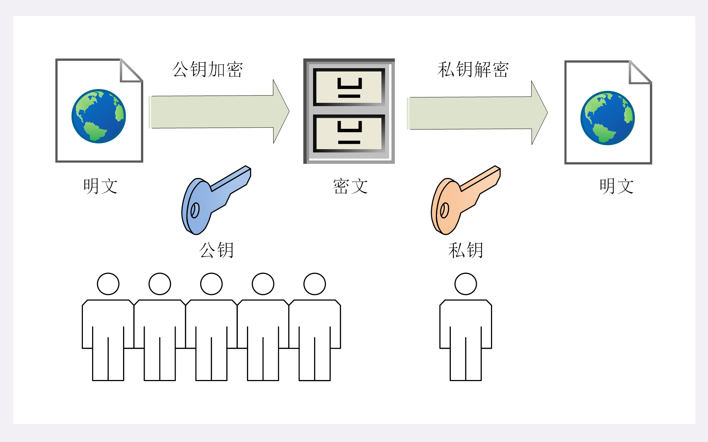
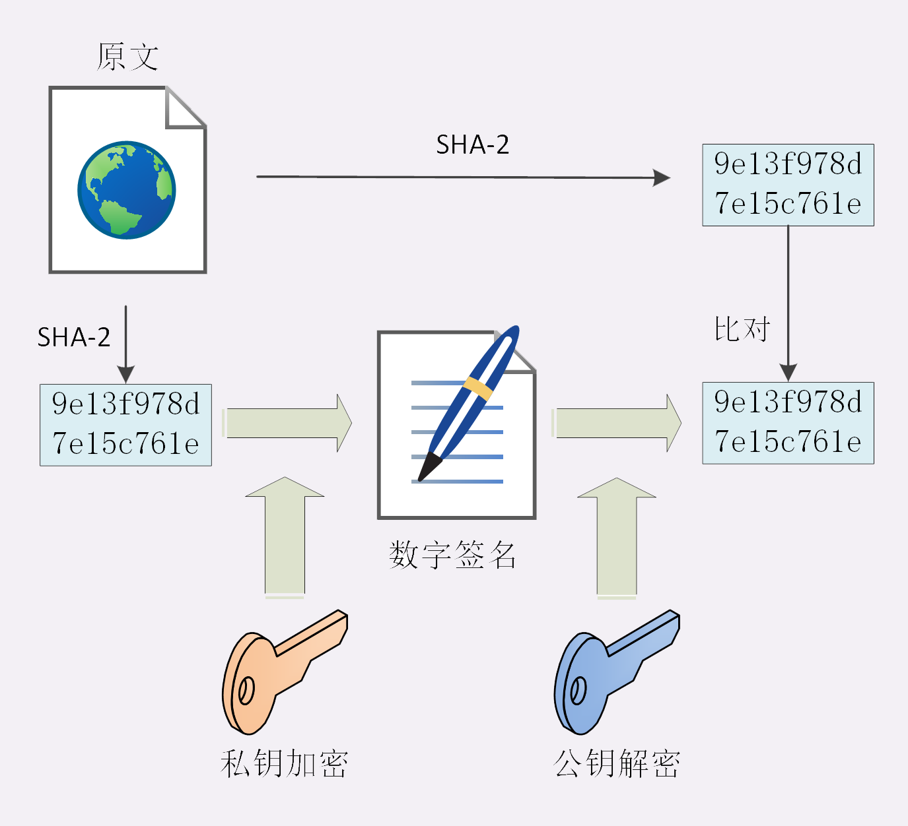

**对称加密**

​	加密和解密时使用的密匙都是同一个,是对称的,只要保证密匙的安全,整个通信过程就可以说具有了机密性

​	常用:`AES`,`ChaCha20`

**加密分组模式**

​	对称算法还有一个**分组模式**,它可以让算法用固定长度的密匙加密任意长度的明文,把小秘密(密钥)转化为大秘密(密文)

**非对称加密**

​	解决如何把密钥安全的传递给对方,常用`RSA`,`ECC`

​	非对称加密有两个密匙,一个公钥,一个私钥,两个密钥是不同的,不对称,公钥可以给任何人使用,而私钥必须严格保密

​	公钥和私钥有个特别的**单向性**,公钥加密后只能用私钥解密,私钥加密后只能 用公钥解密

**混合加密**

​	解决非对称加密通信速度问题

​	在通信刚开始的时候使用非对称算法,比如`RSA`,`ECDHE`首先解决密钥交换的问题

​	然后用随机数产生对称算法使用的**会话密钥**,再用公钥加密,因为花花密钥很短,通常只有16字节或32字节,所以慢一点也无所谓

​	对方拿到密文后用私钥解密,取出会话密钥,这样双方就实现了对称密钥的安全交换,后续就不在使用非对称加密,全都使用对称加密	

**完整性&&摘要算法**

​		实现完整性的手段主要是**摘要算法**,也就是常说的散列函数,哈希函数(HASH Function)

​	只有算法,没有必要,加密后的数据无法解密,不能从摘要逆推出原文

​	`MD5(Message-Digest5)`,`SHA-1(Secure Hash Algorithm1)`,他们就是最常用的摘要算法,能够生成16字节和20字节长度的数字摘要,但这两个算法的安全强度比较低,不够安全,在`TLS`里已经被禁止使用了

​	目前`TLS`推荐使用的是`SHA-1`的后继者`SHA-2`

​	`SHA-2`实际上是一系列摘要算法的统称,总共有6种,常用的有`SHA224`,`SHA256`,`SHA384`,分别能够生成28字节,32字节,48字节的摘要

​	摘要算法保证了'数字摘要'和原文是完全等价的,我们只要在原文后附上它的摘要,就能够保证数据的完整性

​	摘要算法不具有机密性,如果明文传输,那么黑客可以修改消息后把摘要也一起修改了,网站还是鉴别不出完整性

​		所以真正的完整性必须要建立在机密性之上,在混合加密系统里用回话密钥加密消息和摘要,这样黑客无法得知明文,也就没有办法动手脚了

​	这有个数据,哈希消息认证码(HMAC)

**数字签名**

​	加密算法结合摘要算法,我们的通信过程可以说是比较安全了,但是通信的两个端点无法保证

​	黑客可以伪装成网站来窃取信息,反过来他也可以伪装成你,向网站发送支付等消息,网站没有办法确认你的身份,钱可能就这么被偷走了

​	数字签名原理,就是把公钥私钥用法反过来,之前是公钥加密,私钥解密,现在是私钥加密,公钥解密

​	但因为非对称加密效率太低,所以私钥只加密原文的摘要,这样运算量就小的多,而且得到的数字签名也很小,方便保管和传输

​	签名和公钥一样完全公开,任何人都可以获取.但这个签名只有用私钥对应的公钥才能解开,拿到摘要后,再对比原文验证完整性,就可以证明消息确实是你发的

​	

​	这两个行为专业术语,**签名** 和 **验签**

​	只要和网站互相交换公钥,就可以用签名和验签来确认消息的真实性,因为私钥保密,黑客不能伪造签名,就能保证通信双方的身份

**数字证书和CA**

​	解决**公钥的信任**问题,因为谁都可以发布公钥,我们缺少防止黑客伪造公钥的手段

​	找一个公认的可信的第三方,让它作为信任的起点,递归的终点,**CA**(Certificate Authority,证书认证机构),由它来给各个公钥签名,用自身的信誉来保证公钥无法伪造,是可信的

​	CA对公钥的签名认证也是由格式的,需要包含序列号,用途,颁发者,有效时间等等,把这些打成一个包再签名,完整地证明公钥关联的各种信息,形成**数字证书**

​	证书分`DV`,`OV`,`EV`三种,区别在于可信任程度

**DV**

​	DV是最低的,只是域名级别的可信,背后是谁不知道

**EV**

​	EV是最高的,经过了法律和审计的严格核查,可以证明网站拥有者的身份(在游览器地址栏会显示出公司的名字,如:Apple,GitHub)

CA怎么证明自己?

​	小一点的CA可以让大CA签名认证,但联调的最后,也就是RootCA,就只能字节证明自己了,这个就叫**自签名证书**或者**根证书**

**证书体系的弱点**

1. CA失误或者被欺骗,签发了错误的证书,虽然证书是真的,可它代表的网站缺失假的
2. CA被黑客攻陷,或者CA有恶意,因为它是根证书,整个信任链里的所有证书就都不可信了

解决:

1. CRL(证书吊销列表)和OCSP(在线证书状态协议),及时废纸有问题的证书
2. 

第二种因为涉及的证书太多,就只能操作系统和游览器从根上撤销对CA的信任,列入黑名单

**小结:**

1. 摘要算法用来实现完整性,能够为数据生成独一无二的指纹
2. 数字签名是私钥对摘要的加密,可以由公钥解密后验证,实现身份认证和不可否认
3. 公钥的分发需要使用数字证书,必须由CA的信任链来验证,否则就是不可信的
4. 作为信任链的源头CA有时也会不可信,解决办法有CRL,OCSP还有终止信任L