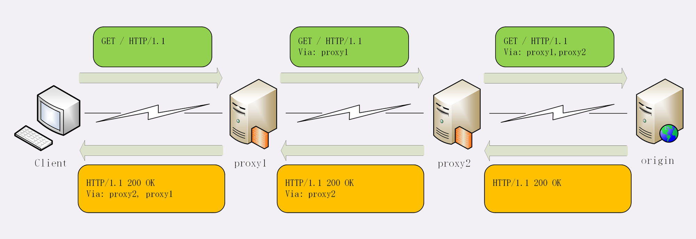

**代理服务器**

1. 负载均衡|
   代理服务器掌握请求分发,决定由后面的哪台服务器来响应请求

2. 健康检查
   使用心跳等机制监控后端服务器,发现有故障就及时踢出集群,保证服务高可用

3. 安全防护
   保护被代理的后端服务器,限制IP地址或流量,抵御网络攻击和过载

4. 加密卸载
   对外网使用`SSL/TLS`加密通信认证,而在安全的内网不加密,消除加解密成本

5. 数据过滤

   拦截上下行的数据,任意指定策略修改请求或者响应

6. 内容缓存
   暂存,复用服务器响应

**Via**

​	通用字段,每当报文经过一个代理节点,代理服务器就会把自身的信息追加到字段的末尾

​	如果通信链路中有很多中间代理,就会在`Via`里形成一个列表,这样就可以知道报文纠结走过了多少个环节才到达了目的地



​	`Via`字段直接进了客户端和原服务器判断是否存在代理的问题,还不能知道对方的真实信息

**X-Forwarded-For**

​	每经过一个代理节点就会在字段里追加一个信息,追加的是请求方的IP地址,在字段里最左边的IP地址就客户端的地址

**X-Real-IP**

​	记录客户端IP地址,没有中间的代理信息,相当于`X-Forwarded-For`的简化版.

**X-Forwarded-Host**

​	客户端请求的原始域名

**X-Forwarded-Proto**

​	客户端原始协议名


**代理协议**

​	`X-Forwarded-For`等字段,源服务器就可以拿到准备的客户端信息,但对于代理服务器来说并不是一个最佳的解决方案

​	`X-Forwarded-For`操作代理信息必须要解析`HTTP`报文头,成本高,原本只需要转发而现在必须解析数据再修改数据

​	由于上面原因出现了代理协议,代理协议有v1,v2两个版本,v1和HTTP差不多,也是明文,而v2是二进制格式

**v1**

​		在`HTTP`报文前增加了一行`ASCII`码文本,相当于又多了一个头,开头必须是`PROXY`五个大写字母,然后是`TCP4`或者`TCP6`,表示客户端的IP地址类型,再后面是请求方地址,应答方地址,请求方端口号,应答方端口号,最后用一个回车换行(\r\n)

```js
PROXY TCP4 1.1.1.1 2.2.2.2 55555 80\r\n
GET / HTTP/1.1\r\n
Host: www.xxx.com\r\n
\r\n
```

​	服务器看到这样的报文,只要解析第一行就可以拿到客户端地址,不需要再去解析`HTTP`数据

​	

