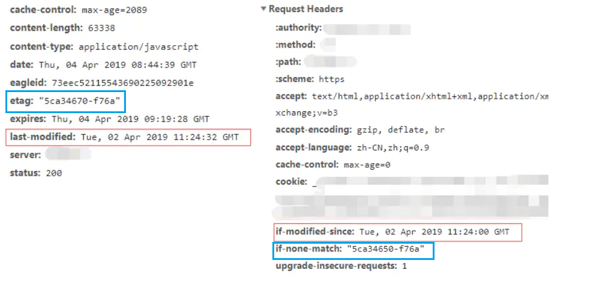

**缓存作用**

- 减少了冗余的**数据传输**,节省了网费
- 减少了服务器的负担,大大提高了网站的**性能**
- 加快了客户端加载网页的**速度**

**强缓存**

​	强制缓存如果生效,不需要再和服务器进行交互,而对比缓存不管是否生效,都需要与服务端发生交互

强制缓存优先级高于协商缓存,当执行强制缓存的规则时,如果缓存生效,直接使用缓存,不再执行协商缓存规则


**协商缓存**

​	第一次请求数据,服务器会将缓存标识和数据一起返回给客户端,客户端将二者备份至缓存数据库中

​	再次请求数据时,客户端将备份的缓存标识发送给服务器,服务器根据缓存标识进行判断,判断成功后,返回`304`状态码,通知客户端比较成功,可以使用缓存数据


**强缓存&协商缓存区别**

​	强缓存命中,不会请求服务器,直接请求缓存

​	协商缓存命中,会请求服务器,不会返回内容,然后读取缓存 `304`,通知客户端比较成功,可以使用缓存数据


**Cache-Control**

**max-age**

​	`max-age=30`就是资源的有效时间,告诉游览器,这个页面只能缓存30秒,之后就算是过期,不能用.

​	`max-age`是生存时间,时间起点是响应报文的**创建时间**

**no_store**

​	不允许缓存,用于某些变化频繁的数据,如秒杀页面

**no_cache**

​	可以缓存,但在使用之前必须要去服务器验证是否过期,是否有最新的版本

**must-revalidate**

​	如果缓存不过期就可以继续使用,但过期了如果还想用就必须去服务器验证


**客户端控制缓存**

​	`Cache-Control`服务器和客户端都可以使用这个字段进行缓存控制,互相协商缓存策略

**刷新**

​	当你点''刷新''按钮的时候,游览器会在请求头里加一个`Cache-Control:max-age=0`,因为`max-age`是生存时间,本地缓存里的数据至少保存了几秒钟,所以游览器不会使用缓存,而是向服务器发请求,服务器看到`max-age=0`,也就会用一个最新生成的报文回应游览器

**Ctrl+F5刷新**

​	游览器发送`Cache-Control:no-cache`,含义和`max-age=0`基本一样

**游览器缓存**

​	前进,后退,跳转这些重定向动作中游览器只用基本的请求头,没有`Cache-Control`所以就会检查缓存,直接利用之前的资源,不再进行网络通信

**注意:**

​	源服务器设置完`Cache-Control`后必须为报文加上`Last-modified`或`ETag`字段,否则,客户端和代理后面就无法使用条件请求来验证缓存是否有效,也就不会有304缓存重定向了

**条件请求**

​	`Cache-Control`做缓存控制只能是刷新数据,不能很好地利用缓存数据,又因为缓存会失效,使用前还必须要去服务器验证是否是最新版

​	`HTTP`协议定义了一系列`if`开头的条件请求字段,专门用来检查验证资源是否过期,把两个请求才能完成的工作合并在一个请求里做,验证的责任也交给服务器**if-Modified-Since**,**if-None-Match**

**Last-Modified**

​	响应时告诉客户端此资源的**最后修改时间**

**if-Modified-Since**

​	当资源具有`Last-Modified`声明,则再次向服务器请求时带上头 `if-modified-Since`

**流程**

​	第一次的响应报文预先提供`Last-modified`和`ETag`,然后第二次请求时就可以带上缓存里的原值,验证资源是否是最新的,搭配条件请求使用

​	第一次响应头`Last-Modified` ---->第二次请求头`if-modified-since`

​	第一次响应头`etag`---->第二次请求头`if-none-match`

​	如果资源没有变,服务器就回应一个`304 Not Modified`表示缓存依然有效,游览器可以更新一下有效期,正常使用

​	




`Last-modified`就是文件的最后修改时间,如果响应报文里提供了`Last-modified`,但没有`Cache-Control`或`Expires`,游览器会自己计算缓存时间,RFC建议:(Date-Last-modified)*10%

**最后修改时间存在问题**

1. 某些服务器不能精确得到文件的**最后修改时间**,这样就无法通过最后修改时间来判断文件是否有更新了

2. 某些文件的修改非常频繁,在秒以下的时间内进行修改,`Last-Modified`只能**精确到秒**
3. 一些文件的最后修改时间改变了,但是内容并未改变.我们不希望客户端认为这个文件修改了
4. 如果同样的一个文件位于多个CDN服务器上的时候内容虽然一样,修改的时间不一样


**Etag**

​	`ETag`是实体标签的缩写,是资源的一个唯一标识,主要市用来解决`Last-Modified`修改时间无法准确区分文件变化的问题

​	使用`ETag`就可以精确地识别资源的变动情况,让游览器能够更有效地利用缓存

**强ETag**

​	要求资源在字节级别必须完全相符

**弱ETag**

​	在值前有个`w/`标记,只要求资源在语义上没有变化,但内部可能会有部分发送了改变

**Ctrl+F5,Last-modified和ETag**

​	即使有`Last-modified`和`ETag`,强制刷新也能够从服务器取最新的数据(返回200而不是304)

​	强制刷新请求头中没有了`if-None-Match`,而且`Cache-Control:no-cache:no-cache`多了`Pragma:no-cache`(禁用缓存),没有条件请求头,服务器就无法处理缓存,就只能返回最新的数据

## 缓存代理

**private**

​	只能在客户端保存,用户私有,不能放在代理服务器上与别人共享

**public**

​	缓存完全开发,谁都可以存,谁都可以用


​	缓存失效后重新验证也要区分开:

**must-revalidate**

​	只要过期就必须回源服务器验证

**proxy-revalidate**

​	只要求代理的缓存过期后必须验证,不必回源,只验证到代理这个环节就行了

​	客户端和代理缓存有效期一致

**s-maxage**

​	缓存的生产时间,只限定在代理上能够存多加,而客户端仍然使用`max-age`

**no-transform**

​	代理有时候会对缓存下来的数据做一些优化,比如把图片生成png,webp等几种格式,方便今后的请求处理,而`no-transform`就会禁止这样做

**例:**

```js
private,max-age=5  //缓存5秒,代理不缓存
public,max-age=5,s-maxage=10 //代理缓存,客户端有效期5秒,代理有效期10秒

max-age=30,proxy-revalidate,no-transform //默认public,有效期30s,客户端和代理缓存有效期一致,不能对数据做优化
```


**客户端的缓存控制**

**max-stale**

​	代理上的缓存过期了也可以接受,但不能过期太多,不能超过X秒不要

**min-fresh**

​	缓存必须有效,而且必须在x秒后依然有效

**only-if-cached**

​	只接受代理缓存的数据,不接受源服务器的响应,如果代理上没有缓存或者缓存过期,就给客户端返回504(Gateway Timeout )


**如何干脆不发请求**

​	`Expires`是服务器响应消息头字段,在响应http请求时告诉游览器在工期时间前游览器可以直接从游览器缓存取数据,而无需再次请求,这是`HTTP1.0`的内容,现在游览器均默认使用`HTTP1.1`,所以基本可以忽略

​	`Cache-Control`与`Expires`的作用一致,都是指明当前资源的有效期,控制游览器是否直接从游览器缓存取数据还是重新发请求到服务器,如果同时设置的话,其优先级高于`Expires`

```js
function send(req, res, file) {
    let expires = new Date(Date.now() + 60 * 1000);
    res.setHeader('Expires', expires.toUTCString());
    res.setHeader('Cache-Control', 'max-age=60');
    res.writeHead(200, { 'Content-Type': mime.lookup(file) });
    fs.createReadStream(file).pipe(res);
}
```

