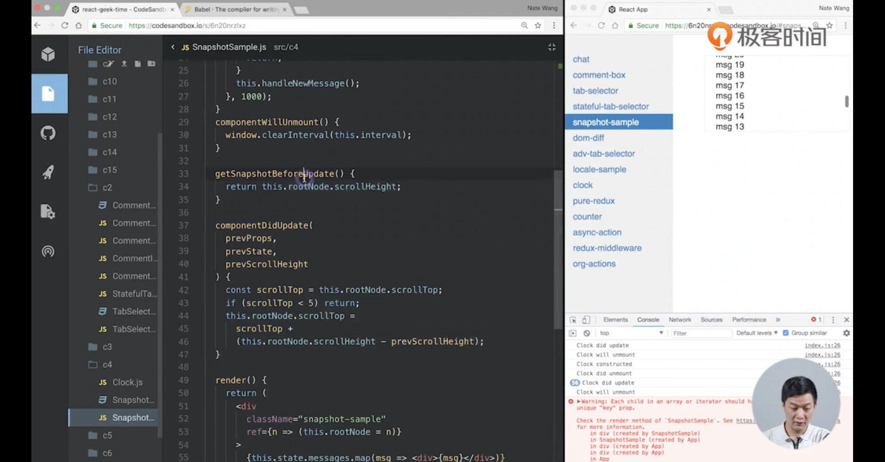
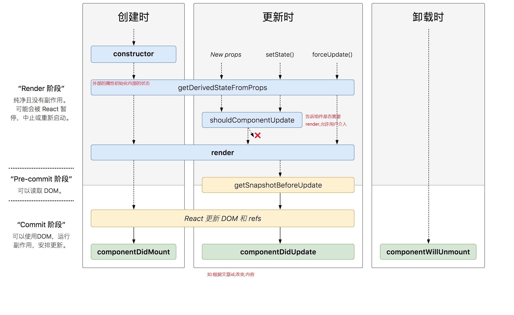

**constructor**

1. 用于初始化内部状态,很少使用
2. 唯一可以直接修改state的地方

**getDervedStateFromProps**

1. 当`state`需要从`props`初始化时使用
2. 尽量不要使用: 维护两者状态一致性会增加复杂度
3. 每次`render`都会调用
4. 典型场景: 表单控件获取默认值

**componentDidMount**

1. UI渲染完成后调用
2. 只执行一次
3. 典型场景 :获取外部资源

**componentWillUnmount**

1. 组件移除时被调用
2. 典型场景 : 资源释放,清除定时器

**getSnapshotBeforeUpdate**

1. 在页面`render`之前调用,`state`已更新
2. 典型场景: 获取`render`之前的`DOM`状态

> 背景: 聊天室,查看历史消息
>
> 问题: 新消息出现在最上方,向下查看历史消息,当查看历史消息时有新消息,此时滚动条会联动
>
> 期望: 查看历史消息,来新消息时,滚动条不滚动
>
> 解决: 在`render`之前获取`scrollHeight`,在`UI`更新后获取`scrollTop`和页面高度变化

****

**componentDidUpdate**

1. 每次UI更新时被调用
2. 典型场景: 页面需要根据`props`变化重新获取数据

场景:根据id显示文章内容

**shouldComponentUpdate**

1. 决定`Virtual DOM`是否要重绘
2. 一般可以由`pureComponent`自动实现
3. 典型场景: 性能优化

