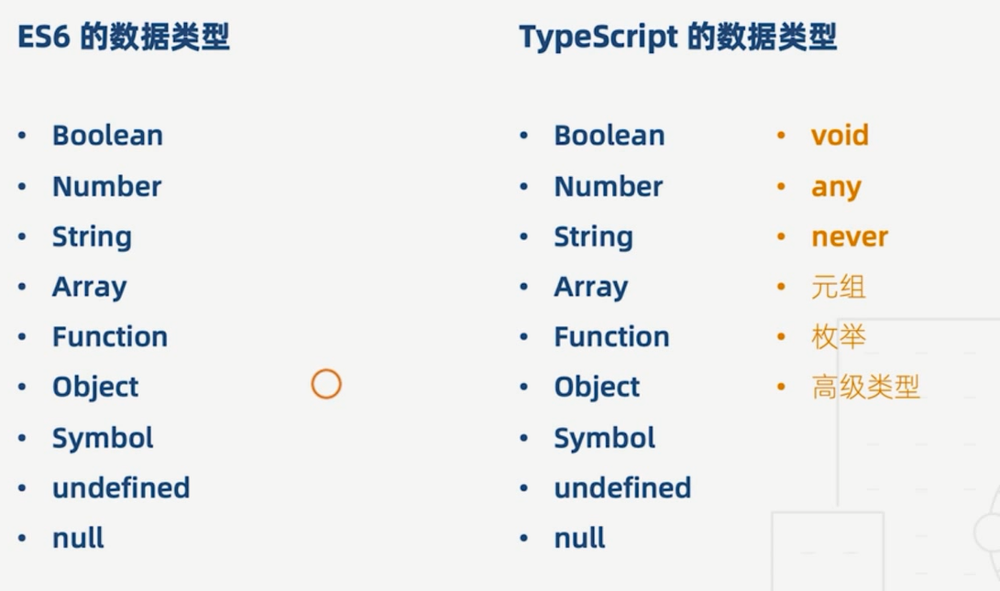

# TS

## 类型基础

1. 强类型语言

   不能改变变量的数据类型,除非进行强制类型转换

2. 弱类型语言

   能够改变变量的数据类型

3. 静态类型语言

   在编译阶段确定变量的类型

4. 动态类型语言

   在执行阶段确定变量的类型

   ## 基本类型



### 原始类型

```js
let bool: boolean = true
let num: number | undefined | null = 123
let str: string = 'abc'
```

### Array

```js
let arr1: number[] = [1, 2, 3]
let arr2: Array<number | string> = [1, 2, 3, '4']

```


### Function

​	输入多余的（或者少于要求的）参数，是不被允许的

```js
function sum(x: number, y: number): number {
    return x + y;
}
```

**函数表达式**

```js
let add = (x:number,y:number)=>x+y;

let muSun = function(x:number,y:number):number{
    return x+y
}
```

​		这是可以通过编译的，不过事实上，上面的代码只对等号右侧的匿名函数进行了类型定义，而等号左边的 mySum，是通过赋值操作进行类型推论而推断出来的。如果需要我们手动给 mySum 添加类型

```js

let mySum: (x: number, y: number) => number = function (x: number, y: number): number {
    return x + y;
};


let compute : (x:number,y:number)=>number;
compute = (a,b)=>a+b;
```

在 TypeScript 的类型定义中，`=>` 用来表示函数的定义，左边是输入类型，需要用括号括起来，右边是输出类型。

**可选参数**

可选参数必须接在必须参数后面,就是说**可选参数后面不允许再出现必须参数了**

```js
function sum(x: number, y?: number): number {
    return x + y;
}
```

**重载**

**定义:**允许创建数项名称相同但输入输出类型或个数不同的子程序子程序)，它可以简单地称为一个单独功能可以执行多项任务的能力。

**JS重载:**允许一个函数接受不同数量或类型的参数时,作出不同的处理

```js
function reverse(x:number):number;
function reverse(x:string):string;
function reverse(x:number|string):number|string {
    if (typeof x==='number'){
        return Number(x.toString().split('').reverse().join(''))
    }else if(typeof x ==='string'){
        return x.split('').reverse().join('')
    }
}
```

### Object

```js
let obj: { x: number, y: number } = { x: 1, y: 2 }
obj.x = 3
```

### undefined / null

​		任何类型子类型,可以赋值给其他类型,需要将`tsconfig`中的`strictNullChecks`设置为`false`

```js
let num: number = 123
let un: undefined = undefined
let nu: null = null
num = undefined
num = null
#不设置 strictNullChecks 还可以设置num为联合类型
let num: number | undefined | null = 123
```

### symbol

```js
let s1: symbol = Symbol()
let s2 = Symbol()
// console.log(s1 === s2) //false
```

## TS数据类型

### void

JS没有空值的概念,TS用`void`表示没有任何返回值

```js
function alertName(): void {
    alert('My name is Tom');
}
```

### any

​		不指定类型就是any,可以任意赋值

```js
let x
x = 1
x = []
x = () => {}
```

### never

1. 报错
2. 死循环

```js
let error = () => {
    throw new Error('error')
}
let endless = () => {
    while(true) {}
}
```


### 元祖

特殊的数组

* 限定数组的类型和个数
* 可以越界添加项,但是无法访问

```js
let tuple : [number,string] = [0,'1'];
//tuple.push(2);
//console.log(tuple);
//tuple[2]
```

### 枚举

### 高级类型