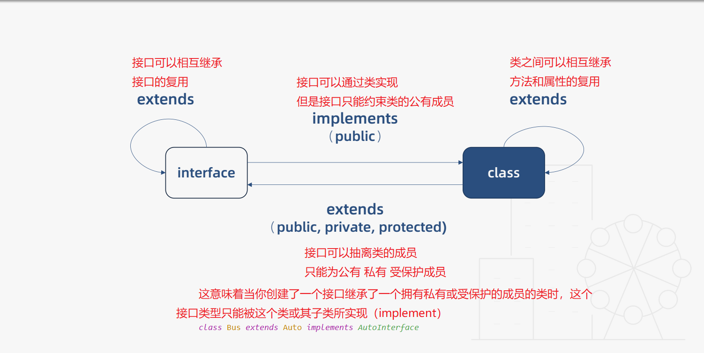

# 函数类型接口

## Function

输入多余的（或者少于要求的）参数，是不被允许的

```js
function sum(x: number, y: number): number {
    return x + y;
}

```

**函数表达式**

```js
let add = (x:number,y:number)=>x+y;

let muSun = function(x:number,y:number):number{
    return x+y
}
```

​		这是可以通过编译的，不过事实上，上面的代码只对等号右侧的匿名函数进行了类型定义，而等号左边的 mySum，是通过赋值操作进行类型推论而推断出来的。如果需要我们手动给 mySum 添加类型

```js

let mySum: (x: number, y: number) => number = function (x: number, y: number): number {
    return x + y;
};


let compute : (x:number,y:number)=>number;
compute = (a,b)=>a+b;
```

​		在 TypeScript 的类型定义中，`=>` 用来表示函数的定义，左边是输入类型，需要用括号括起来，右边是输出类型。

**可选参数**

​		可选参数必须接在必须参数后面,就是说**可选参数后面不允许再出现必须参数了**

```js
function sum(x: number, y?: number): number {
    return x + y;
}
```

**默认参数**

​		必选参数前默认参数必须赋值可以为`undefined`

```js
function add(x:number,y?=0,z:number,q=1) {
return x+y+z+q
}

console.log(add(1,undefined, 3));
```

剩余参数

​	参数不确定使用剩余参数,数组类型

```js
function add2(x:number,y:number,...rest:number[]) {
    return x+rest.reduce((pre,cur)=>(pre+cur))
}

console.log(add2(1, 2, 3, 4, 5, 6));
```


**重载**

**定义:**允许创建数项名称相同但输入输出类型或个数不同的子程序子程序)，它可以简单地称为一个单独功能可以执行多项任务的能力。

**TS重载:**允许一个函数接受不同数量或类型的参数时,作出不同的处理

```js
function reverse(x:number):number;
function reverse(x:string):string;
function reverse(x:number|string):number|string {
    if (typeof x==='number'){
        return Number(x.toString().split('').reverse().join(''))
    }else if(typeof x ==='string'){
        return x.split('').reverse().join('')
    }
}
```

## 类

### 类

- 类成员的属性都是实例属性
- 类成员的方法都是实例方法

```js
class Dog{
    //实例属性需要有初始值
    constructor(name:string) {
        this.name = name
    }
    name:string
    run(){}
}

console.log(Dog.prototype);
```

### 类的继承

```js
class Husky extends Dog{
    constructor(name:string,color:string) {
        super(name);
        this.color = color;
    }
    color:string
}
```

### 类的修饰符

- 类的修饰符
- public 所有人可见
- private 私有成员 外部和子类都不能调用
- protected 受保护成员 只能在类或者子类中访问 类的实例无法访问
- readonly 只读属性
- //static 静态成员  只能通过类名进行调用 不能用过子类访问

```js
class Dog{
    //private constructor 既不能被实例化 也不能继承
   // protected constructor 不能被实例化  只能被继承 用于基类
    //public color
    private constructor(name:string,public color:string) {
        this.name = name
    }
  public  name:string
  // color:string  因为 public color:string color变为实例属性
    run(){}
    private pri(){}
    protected pro(){}
    readonly legs:number = 4
    static food:string = 'bones'
}
```


## 函数类型接口

- 函数定义   返回值靠TS推断省去
- 变量定义
- 接口定义
- 类型别名

```js
#1
function add(x:number,y:number) {
return x+y
}
#2  变量定义函数类型

let add: (x:number,y:number)=>number;
#3 接口定义函数类型
interface add {
    (x:number,y:number):number
}
#4 类型别名
type Add = (x:number,y:number) =>number


let fn :Add=(a,b)=>a+b
```

## 混合类型接口

- 可以定义函数

- 也可以像对象 有属性和方法

  ```js
  interface Lib {
      ():void; //函数
      version:string; //属性
      doSomething():void //方法
  }
  ```

1. 单例

   ```js
   #单例
   //let lib:Lib=()=>{};
   //提示 缺少属性使用断言
   let lib:Lib=(()=>{})as Lib;
   
   lib:version:'1.0';
   lib.doSomething=()=>{};
   ```

2. 多个实例

   ```js
   function getLib() {
       let lib:Lib=(()=>{})as Lib;
       lib:version:'1.0';
       lib.doSomething=()=>{};
       return lib
   }
   let lib1 = getLib();
   lib1.doSomething();
   ```

## abstract 抽象类

​		无法创建抽象类的实例,只能被继承

​		**优点:**代码的复用和扩展

```js
abstract class Animal {
    eat(){
        console.log('eat');
    }
}

class Dog extends Animal {
    constructor(name:string){
        super()
        this.name = name
    }
    name:string;
    run(){}
};
let dog = new Dog('wangwang');
```

1. 抽象方法
   不指定方法的具体实现,子类有自己的实现

   ```js
   # abstract sleep():void
   abstract class Animal {
       eat(){
           console.log('eat');
       }
       abstract sleep():void
   }
   
   class Dog extends Animal {
       constructor(name:string){
           super()
           this.name = name
       }
       name:string;
       run(){}
       sleep(): void {
           console.log('Dog sleep');
       }
   };
   let dog = new Dog('wangwang');
   ```

## 抽象类的多态

​	父类采用定义抽象方法,子类具体实现,子类调用时调用自己的方法

```js
abstract class Animal {
    eat(){
        console.log('eat');
    }
    abstract sleep():void
}

class Dog extends Animal {
    constructor(name:string){
        super()
        this.name = name
    }
    name:string;
    run(){}
    sleep(): void {
        console.log('Dog sleep');
    }
};
let dog = new Dog('wangwang');

class Cat extends Animal {
sleep(): void {
    console.log('cat sleep');
}
}
let cat = new Cat();
let arr:Animal[] =[dog,cat]
arr.forEach(x=>{
    x.sleep()
})
//Dog sleep
//cat sleep
```

## this

​		实现子类父类连贯的链式调用

```js

class WorkFlow{
    step1(){
        return this
    }
    step2(){
        return this
    }

}
new WorkFlow().step1().step2()

class MyFlow extends WorkFlow{
    next(){
        return this
    }
}
new MyFlow().next().step1().step2()
```

## 类和接口



### 类继承接口

​		`implements`类实现接口时 需要实现接口中所有的属性

```js
interface Human{
    //接口不能约束类的构造函数
    //new(name:string):void
    name:string;
    eat():void
}
class Asian implements Human {
    constructor(name:string) {
    this.name = name
    }
    //接口只能约束类的公有成员 私有成员报错
   // private name: string
    name:string
    eat(): void {
    }
    sleep(){}
}
```

### 接口相互继承

​		接口可以相互继承,并且一个接口可以继承多个接口

​		抽离可重用接口.也可以将多个接口合并成一个接口

```js
interface Human{
    name:string;
    eat():void
}
interface Man extends Human{
     run():void
}
interface Child extends Human{
    cry():void
}
interface Boy extends Man,Child{}
let boy:Boy={
    name:'',
     run() {},
     cry() {},
     eat() {},
}
```

### 接口继承类

​		接口可以抽离类的成员,只能为公有,私有,受保护的成员

​		这意味着当你创建了一个接口继承了一个拥有私有或受保护的成员的类时，这个接口类型只能被这个类或其子类所实现（implement）

```js
class Auto{
    state = 1;
   // private state2=2 私有成员
}

//接口隐含了state
interface AutoInterface extends Auto{

}

//实现接口 需要包含接口的属性 state
class C implements AutoInterface{
    state=1;
}

//auto子类实现接口
//这个子类不必实现state属性因为它是Auto的子类集成了state
class Bus extends Auto implements AutoInterface{

}
```