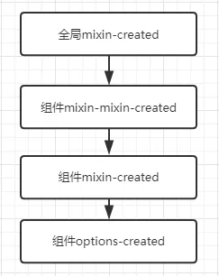
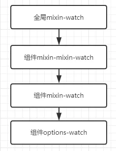
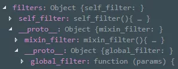

# Mixins

## **什么时候合并**

创建组件实例初始化之前,会把全局选项和组件选项合并

**全局选项**

全局的选项会被传递引用到每个组件中,全局选项和组件选项就会合并起来,组件便能访问到全局选项

1. Vue.components

2. Vue.filter

3. Vue.directive

4. Vue.mixin

   

## 怎样合并

**权重**

从大到小

1. 组件选项
2. 组件-mixin
3. 组件-mixin-mixin
4. ...嵌套mixin
5. 全局选项


**函数合并叠加**

包括: **data provide**

组件权重大

**数组叠加**

lifecycle

生命周期合并为一个数组,权重小的先执行

```js
[
全局 mixin - created
组件 mixin mixin - created
组件 mixin -created
组件 options - created
]

```

执行顺序



**watch**

合并数组,权重小的先执行

```js
[
全局 mixin watch
组件 mixin-mixin watch
组件 mixin watch
组件 options watch
]
```

执行顺序



**原型叠加**

避免覆盖,且还能正常访问

 components filter directives

两个对象合并,不会相互覆盖,而是**权重小**的被放到**权重大**的原型上

```js
A.__proto__ = B
B.__proto__ = C
C.__proto__ = D
```

以`filter`举例

```js
// 全局 filter

Vue.filter("global_filter",function (params) {})

// mixin 的 mixin

var mixin_mixin={    

    filters:{

        mixin_mixin_filter(){}
    }
}

// mixin filter

var test_mixins={
    mixins:[mixin_mixin],    

    filters:{

        mixin_filter(){}
    }
}

// 组件 filter

var a=new Vue({    

    mixins:[test_mixins],    

    filters:{

        self_filter(){}
    }
})
```

打印



**覆盖叠加**

props  methods computed inject

两个对象合并,如果有重复key,权重大的覆盖权重小的

```js
组件
props:{name:''}

组件mixin
props:{name:'',age:''}

//组件name会替换mixin的name

```

**直接替换**

默认处理方式,当选项部数据上面的处理方式的时候,就会这样处理,包含选项:`el`,`template`,`propData`等,两个数据只替换,不合并,权重大的会一直替换权重小的,因为这些属性只允许存在一个,所有只使用权重大的选项组件,设置`template` `mixin` 也设置`template` ,组件优先级最高