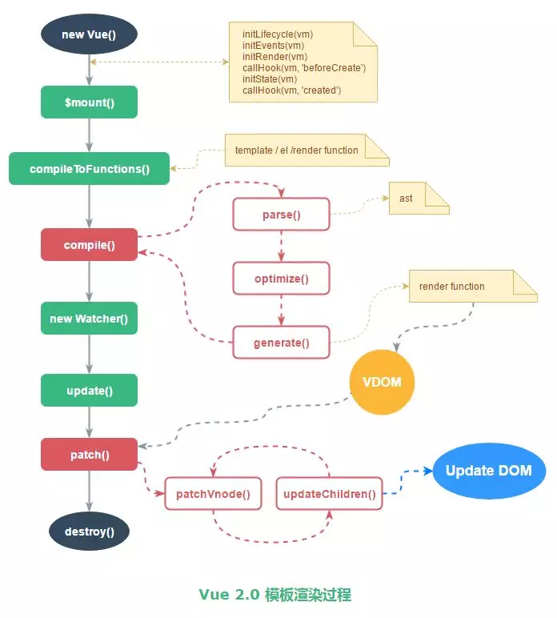

# new Vue发生了什么

位置: `package.json`

```js
  "main": "dist/vue.runtime.common.js",
  "module": "dist/vue.runtime.esm.js",
```


## new Vue

执行`_init`方法

```js
function Vue (options) {
  if (process.env.NODE_ENV !== 'production' &&
    !(this instanceof Vue)
  ) {
    warn('Vue is a constructor and should be called with the `new` keyword');
  }
  this._init(options);
}
```


## init

​	合并配置,初始化生命周期,初始化事件中心,初始化渲染,初始化data、props、computed、watcher等

​	`beforeCreate`时无法访问data，method，computed，watch等,因为`initState`还没有执行

```js
  Vue.prototype._init = function (options) {
    var vm = this;
    // a uid
    vm._uid = uid$3++;
    var startTag, endTag;
    /* istanbul ignore if */
    if (process.env.NODE_ENV !== 'production' && config.performance && mark) {
      startTag = "vue-perf-start:" + (vm._uid);
      endTag = "vue-perf-end:" + (vm._uid);
      mark(startTag);
    }

    // a flag to avoid this being observed
    vm._isVue = true;
    // merge options
    if (options && options._isComponent) {
      // optimize internal component instantiation
      // since dynamic options merging is pretty slow, and none of the
      // internal component options needs special treatment.
      initInternalComponent(vm, options);
    } else {
      vm.$options = mergeOptions(
        resolveConstructorOptions(vm.constructor),
        options || {},
        vm
      );
    }
    /* istanbul ignore else */
    if (process.env.NODE_ENV !== 'production') {
      initProxy(vm);
    } else {
      vm._renderProxy = vm;
    }
    // expose real self
    vm._self = vm;
    initLifecycle(vm);
    initEvents(vm);
    initRender(vm);
    callHook(vm, 'beforeCreate');
    initInjections(vm); // resolve injections before data/props
    initState(vm);
    initProvide(vm); // resolve provide after data/props
    callHook(vm, 'created');

    /* istanbul ignore if */
    if (process.env.NODE_ENV !== 'production' && config.performance && mark) {
      vm._name = formatComponentName(vm, false);
      mark(endTag);
      measure(("vue " + (vm._name) + " init"), startTag, endTag);
    }

    if (vm.$options.el) {
      vm.$mount(vm.$options.el);
    }
  };
```

## initState

```js
function initState (vm) {
  vm._watchers = [];
  var opts = vm.$options;
  if (opts.props) { initProps(vm, opts.props); }
  if (opts.methods) { initMethods(vm, opts.methods); }
  if (opts.data) {
    initData(vm);
  } else {
    observe(vm._data = {}, true /* asRootData */);
  }
  if (opts.computed) { initComputed(vm, opts.computed); }
  if (opts.watch && opts.watch !== nativeWatch) {
    initWatch(vm, opts.watch);
  }
}
```


## 拓展

[vue模板渲染--compile](https://www.jianshu.com/p/743166a8968c)