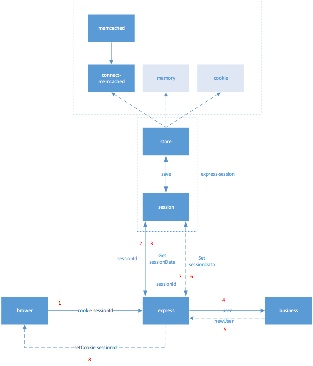

**session**

​	会话控制,存储特定用户回话所需的属性及配置信息,存于服务器,在整个用户会话中一直存在

​	`session`是一个概念,是一个数据对象,用来存储访问者信息

**基础知识**

​	`cookie`存于游览器,`session`存于服务器

​	`cookie`是由游览器支持,并且`http`请求会在请求头中携带`cookie`给服务器

​	`session`仅仅是一个对象信息,可以存到`cookie`,也可以存到任何地方(如内存,数据库).存到哪,可以开发者自己决定,只要实现一个`store`对象,提供`set`,`get`方法即可

**流程**

​	用户第一次访问的时候,我们就会给用户创建一个他的`session`,并在`cookie`中塞一个他的**钥匙key**,所以及时`http`请求时无状态的,但通过`cookie`我们就可以拿到访问者的**钥匙key**,便可以从所有访问者`session`集合中取出对应访问者的`session`

​	关闭游览器,服务端的`session`是不会马上过期的.`session`中间件自己实现了一套管理方式,当访问间隔超过`maxAge`的时候,`session`便会失效

**cookie与session区别**

1. `cookie`数据存放在客户的游览器上,`session`数据放在服务器上
2. `cookie`不是很安全,别人可以分析存放在本地的`cookie`并进行`cookie`欺骗,考虑到安全应当使用`session`
3. `session`会在一定时间内报错在服务器上.当访问增多,会比较占用你服务器的性能,考虑到减轻服务器性能方面,应当使用`cookie`
4. 单个`cookie`保存的数据不能超过4k.很多游览器都限制一个站点最多保存20个cookie

> 将登陆信息等重要信息存放为`session`,其他信息如果需要保留,可以放在`cookie`中

**session中间件**

| 参数              | 描述                                                         |
| :---------------- | :----------------------------------------------------------- |
| name              | 设置 cookie 中，保存 session 的字段名称，默认为 connect.sid  |
| store             | session 的存储方式，默认存放在内存中，也可以使用 redis，mongodb 等 |
| secret            | 通过设置的 secret 字符串，来计算 hash 值并放在 cookie 中，使产生的 signedCookie 防篡改 |
| cookie            | 设置存放 session id 的 cookie 的相关选项，默认为 (default: { path: '/', httpOnly: true, secure: false, maxAge: null }) |
| genid             | 产生一个新的 session_id 时，所使用的函数， 默认使用 uid2 这个 npm 包 |
| rolling           | 每个请求都重新设置一个 cookie，默认为 false                  |
| saveUninitialized | 是指无论有没有session cookie，每次请求都设置个session cookie ，默认给个标示为 connect.sid |
| resave            | 是指每次请求都重新设置session cookie，假设你的cookie是10分钟过期，每次请求都会再设置10分钟 |