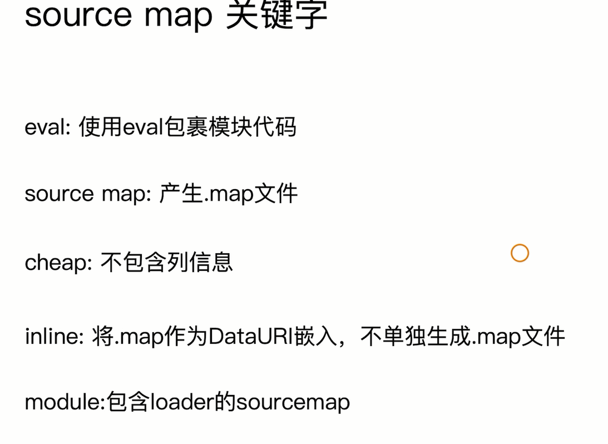
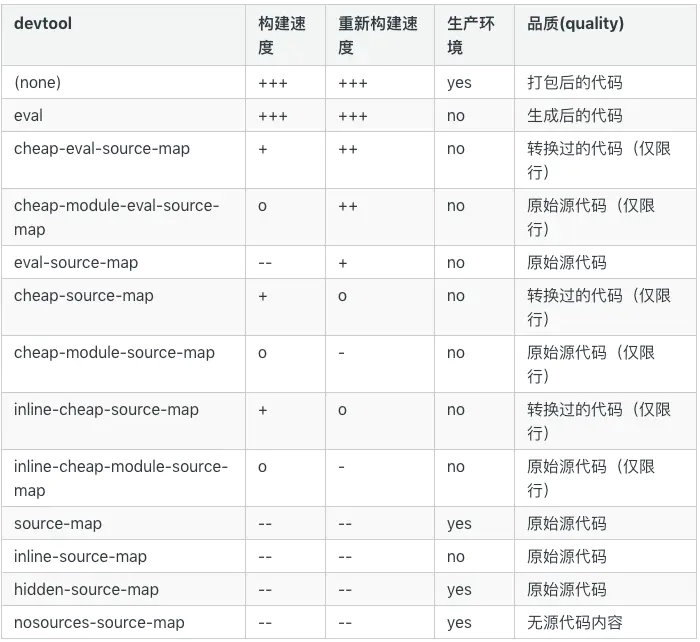

## source map

​		`eval`代码块的最后添加source map的url,指定对应的文件

​		source map 是指将`编译` 、`打包` 、`压缩`后的代码`映射`会源代码的`过程`

​		webpack在编译过程中,如果我们启用了`devtool`,source map就会跟随源代码被传递,最后生成`.map`文件

​		调试代码时,会加载对应的`.map`文件找到对应的源代码

- 安全问题

  不打开开发者工具不会加载,任何人都能看到

  webpack提供了两种hidden-source-map和nosources-source-map来提升source map的安全性

- hidden-source-map

  产出完成的map文件,但是不会在bundle文件中添加对于map文件的引用,开发者工具中看不到map文件,需要`第三方服务`将map文件上传到上面,`Sentry(错误跟踪平台)`能实现

- nosources-source-map

  文件被隐藏,可以在控制台中查看报错信息

- nginx设置白名单

  将`.map文件只对白名单开放`

| 名称                         | 说明                                         |      |
| ---------------------------- | -------------------------------------------- | ---- |
| source map                   | 大和全,单独文件,显示行和列                   |      |
| eval-source-map              | 不会产生单独文件,显示行和列                  |      |
| cheap-module-source-map      | 不会产生列,单独文件,可以保留                 |      |
| cheap-module-eval-source-map | 不会产生文件,集成在打包后的文件中,不会产生列 |      |

  