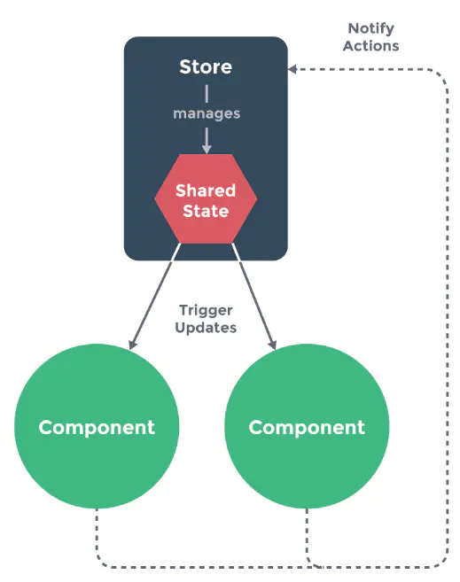
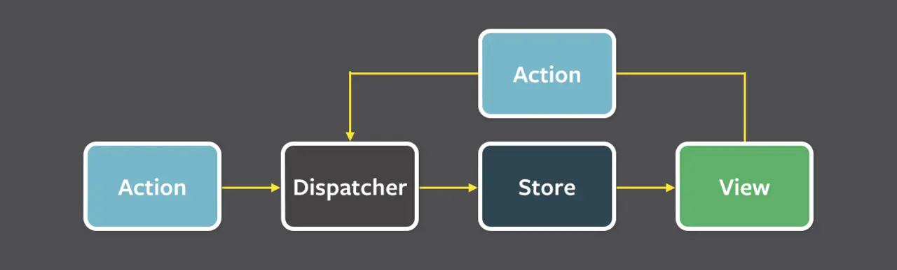

**ue为什么需要状态管理**

​	组件之间需要共享状态.

​	父子孙组件,兄弟组件之间共享状态,需要写很多没有必要的代码,比如:兄弟组件共享状态写一个共同父组件.

如果不对状态进行有效管理,状态在什么时候,由于什么原因,如何变化就会不受控制,很难跟踪和测试

**解决思想**

1. 隔离变化: 把一些容易变化的地方找到共性,隔离出来,不要去影响其他代码
2. 约定优于配置: 约定规范,少写大堆配置

总结: 把组件之间需要共享的状态抽取出来,遵循特定的约定,统一来管理,让状态变化可以预测


### **Store模式**

​	最简单的处理,就是把状态存到一个外部变量里面,

```js
var store = {
  state: {
    message: 'Hello!'
  },
  setMessageAction (newValue) {
    // 发生改变记录点日志啥的
    this.state.message = newValue
  },
  clearMessageAction () {
    this.state.message = ''
  }
}
```

​	`store`的`state`来存数据,`store`里面有一堆的`action`,这些`action`来控制`state`的改变,因为都走`action`,我们就可以知道改变是如何被触发的,也可以记录日志



​	不过这里没有限制组件里面不能修改`store`里面的`state`,所以需要规定一下,组件不允许直接修改数据`store`实例`state`,组件必须通过`action`来改变`state`,这样约定的好处,我们能够记录所有的`store`中发生的`state`改变,同时能做到记录变更,保存状态快照,历史回滚/时光旅行的先进的调试工具

​	这样一个简单的`Flux`架构就实现了

### **Flux**

​	`Flux`其实是一种思想,类似`MVC`,`MVVM`,他给出了一些基本概念,所有的框架都可以根据他的思想来做一些实现

​	`Flux`把一个应用分成了4个部分:

- View
- Action
- Dispatcher
- Store



​	`Flux`的最大特点就是数据都是**单向流动**的	

​	整个过程需要注意的点:

1. `Dispatcher`的作用是接收所有的`Action`,然后发给所有的`Store`.这里的`Action`可能是`View`触发的,也有可能是其他地方触发的,比如测试用例
2. `Store`的改变只能通过`Action`,不能通过其他方式.也就是说`Store`不应该有公开的`Setter`,所有`Setter`都应该是私有的,只能有公开的`Getter`.具体`Action`的处理逻辑一般放在`Store`里

**缺点(特点)**

​	一个应用可以拥有多个`Store`,多个`Store`之间可能有依赖关系,`Store`封装了数据还有处理数据的逻辑

### Redux


**Store**

​	`Redux`里面只有一个`Srore`,整个应用的数据都在这个大`Store`里面.`Store`的`State`不能直接修改,每次只能返回一个新的`State`.

​	`Store`允许使用`store.subscribe`方法设置监听函数,一旦`State`发生变化,就自定执行这个函数,在`React`中,把组件的`render`方法或`setState`方法订阅进去

**Action**

```js
const action = {
  type: 'ADD_TODO',
  payload: 'Learn Redux'
};
```

**Reducer**

​	`Redux`没有`dispatcher`的概念,`Store`里面已经集成了`dispatch`方法,`store.dispatch()`是`View`发出`Action`的唯一方法

```js
import { createStore } from 'redux';
const store = createStore(fn);

store.dispatch({
  type: 'ADD_TODO',
  payload: 'Learn Redux'
});
```

​	`Redux`用一个叫做`Reducer`的纯函数来处理事件.`Store`收到`Action`以后,必须给出一个新的`State`,这样`View`才会发生变化.这种`State`的计算过程就叫做`Reducer`

​		为什么叫`Reducer`,reduce  是一个函数式编程的概念，经常和  map  放在一起说，简单来说，map  就是映射，reduce  就是归纳。映射就是把一个列表按照一定规则映射成另一个列表，而 reduce 是把一个列表通过一定规则进行合并，也可以理解为对初始值进行一系列的操作，返回一个新的值。

​	比如  Array 就有一个方法叫 `reduce`，`Array.prototype.reduce(reducer, ?initialValue)`，把 Array 整吧整吧弄成一个  newValue

​	声明`reducer:`

```js
const defaultState = 0;
const reducer = (state = defaultState, action) => {
  switch (action.type) {
    case 'ADD':
      return state + action.payload;
    default: 
      return state;
  }
};
```

**对比Flux**

- 单一数据源: `Flux`的数据源可以是多个
- `State`是只读的: `Flux`的`State`可以随便改
- 使用纯函数来执行修改: `Flux`执行修改的不一定是纯函数

**中间件**

​	在`Redux`中,同步的表现就是: `Action`发出以后,`Reducer`立即算出`State`.那么异步的表现就是: `Action`发出以后,过一段时间再执行`Reducer`

​	整个`redux`每个步骤都很纯粹,都不太适合加入异步操作,比如`Reducer`,村函数,肯定不能承担异步操作,`Action`就是一个纯对象,放不了操作,只能在发送`Action`的时候加入一些异步操作,给原来的`dispatch`方法包裹一层

```js
let next = store.dispatch;
store.dispatch = function dispatchAndLog(action) {
  console.log('dispatching', action);
  next(action);
  console.log('next state', store.getState());
}
```

​	`Redux`提供了一个`applyMiddleware`方法来应用中间件

```js
const store = createStore(
  reducer,
  applyMiddleware(thunk, promise, logger)
);
```

​	这个方法主要就是把所有的中间件组成一个数据,依次执行.任何被发送到`store`的`action`,现在都会经过`thunk`,`promise`,`logger`这几个中间件了

**redux-thunk**

```js
const createFetchDataAction = function(id) {
    return function(dispatch, getState) {
        // 开始请求，dispatch 一个 FETCH_DATA_START action
        dispatch({
            type: FETCH_DATA_START, 
            payload: id
        })
        api.fetchData(id) 
            .then(response => {
                // 请求成功，dispatch 一个 FETCH_DATA_SUCCESS action
                dispatch({
                    type: FETCH_DATA_SUCCESS,
                    payload: response
                })
            })
            .catch(error => {
                // 请求失败，dispatch 一个 FETCH_DATA_FAILED action   
                dispatch({
                    type: FETCH_DATA_FAILED,
                    payload: error
                })
            }) 
    }
}

//reducer
const reducer = function(oldState, action) {
    switch(action.type) {
    case FETCH_DATA_START : 
        // 处理 loading 等
    case FETCH_DATA_SUCCESS : 
        // 更新 store 等
    case FETCH_DATA_FAILED : 
        // 提示异常
    }
}
```


**redux-promise**

`redux-promise`和`redux-thunk`思想类似,只不过做了一些简化,成功失败手动`dispatch`被封装成自动了

```js
const FETCH_DATA = 'FETCH_DATA'
//action creator
const getData = function(id) {
    return {
        type: FETCH_DATA,
        payload: api.fetchData(id) // 直接将 promise 作为 payload
    }
}
//reducer
const reducer = function(oldState, action) {
    switch(action.type) {
    case FETCH_DATA: 
        if (action.status === 'success') {
             // 更新 store 等处理
        } else {
                // 提示异常
        }
    }
}
```

​	封装少,自由度高,但是代码就会变复杂;封装多,代码变简单了,但是自由度就会变差

### Vuex

​	一个应用仅会包含一个`Store`实例.单一状态树的好处是能够直接定位任一特定的状态片段,在调试的过程中也能轻易地取得整个当前应用状态的快照

**Mutation**

​		`state`不能直接修改,需要通过一个约定的方式,更改`Vuex`的`store`中的状态唯一方法是提交`mutation`.`Vue`中的`mutation`非常类似于事件:每个`mutation`都有一个字符串的事件类型`type`和一个回调函数`handler`

​	`mutation`都是**同步**事务

​	`nutation`有些类似`Redux`的`Reducer`,但是`Vuex`不要求每次都搞一个新的`State`,可以直接修改为`State`,这块又和`Flux`有些类似

​	**具尤大的说法，Redux 强制的 immutability，在保证了每一次状态变化都能追踪的情况下强制的 immutability 带来的收益很有限，为了同构而设计的 API 很繁琐，必须依赖第三方库才能相对高效率地获得状态树的局部状态，这些都是 Redux 不足的地方，所以也被 Vuex 舍掉了。**

**Action**

​	`Vuex`的想法是把同步和异步拆开,异步操作不会干扰同步操作	

### React-redux

​	`Redux`和`Flux`类似,只是一种思想或者规范,它和`React`之间没有关系,一般通过一个叫`react-redux`的库和`React`配合使用

​	如果不用`react-redux`,那么手动处理`Redux`和`UI`的绑定,需要写很多重复代码		

​	`react-redux`只是`redux`和`react`结合的一种实现,`react-redux`多了个`connect`方法连接容器组件和`UI`组件,这里的连接就是一种映射:

- `mapStateToProps`把容器组件的`state`映射到`UI`组件的`props`
- `mapDispatchToProps`把`UI`组件的事件映射到`dispacth`方法

### Redux-saga

​	`redux-thunk`和`redux-promise`这些中间件的思想基本上都是把异步请求放在了`action creator`中,理解起来比较简单

​	`redux-saga`采用了另外一种思路,把所有的异步看成线程,可以通过普通的`action`去触发它,当操作完成时也会触发`action`作为输出.`saga`的意思本来就是一连串的事件

```js
// saga.js
import { take, put } from 'redux-saga/effects'

function* mySaga(){ 
    // 阻塞: take方法就是等待 USER_INTERACTED_WITH_UI_ACTION 这个 action 执行
    yield take(USER_INTERACTED_WITH_UI_ACTION);
    // 阻塞: put方法将同步发起一个 action
    yield put(SHOW_LOADING_ACTION, {isLoading: true});
    // 阻塞: 将等待 FetchFn 结束，等待返回的 Promise
    const data = yield call(FetchFn, 'https://my.server.com/getdata');
    // 阻塞: 将同步发起 action (使用刚才返回的 Promise.then)
    yield put(SHOW_DATA_ACTION, {data: data});
}
```

**对比redux-thunk:**

- 异步数据获取的相关业务逻辑放在了单独的`saga.js`中,不在掺杂在`action.js`或`component.js`中
- `dispatch`的参数是标准的`action`,没有魔法
- `saga`代码采用类似同步的方式书写,代码变得更易读
- 代码异常/请求失败 都可以直接通过 try/catch 语法直接捕获处理。
- 很容易测试，如果是 thunk 的 Promise，测试的话就需要不停的 mock 不同的数据。

**Dva**

​	`dva`是一个基于r`edux`和`redux-saga`的数据流方案,让使用`react-redux`和`redux-saga`编写的代码组织起来更合理,维护更方便

​	`dva`让`redux`,`react-redux`,`redux-saga`写到一起

> 约定优于配置,Dva借鉴了这个思想

```js
app.model({
  // namespace - 对应 reducer 在 combine 到 rootReducer 时的 key 值
  namespace: 'products',
  // state - 对应 reducer 的 initialState
  state: {
    list: [],
    loading: false,
  },
  // subscription - 在 dom ready 后执行
  subscriptions: [
    function(dispatch) {
      dispatch({type: 'products/query'});
    },
  ],
  // effects - 对应 saga，并简化了使用
  effects: {
    ['products/query']: function*() {
      yield call(delay(800));
      yield put({
        type: 'products/query/success',
        payload: ['ant-tool', 'roof'],
      });
    },
  },
  // reducers - 就是传统的 reducers
  reducers: {
    ['products/query'](state) {
      return { ...state, loading: true, };
    },
    ['products/query/success'](state, { payload }) {
      return { ...state, loading: false, list: payload };
    },
  },
});
```

### MobX

`MobX`允许有多个`store`,而且这些`store`里的`state`可以直接修改,不用像`redux`那样每次返回个新的

```js
import React, { Component } from 'react';
import { observable, action } from 'mobx';
import { Provider, observer, inject } from 'mobx-react';

// 定义数据结构
class Store {
  // ① 使用 observable decorator 
  @observable a = 0;
}

// 定义对数据的操作
class Actions {
  constructor({store}) {
    this.store = store;
  }
  // ② 使用 action decorator 
  @action
  incA = () => {
    this.store.a++;
  }
  @action
  decA = () => {
    this.store.a--;
  }
}

// ③实例化单一数据源
const store = new Store();
// ④实例化 actions，并且和 store 进行关联
const actions = new Actions({store});

// inject 向业务组件注入 store，actions，和 Provider 配合使用
// ⑤ 使用 inject decorator 和 observer decorator
@inject('store', 'actions')
@observer
class Demo extends Component {
  render() {
    const { store, actions } = this.props;
    return (
      <div>
        <p>a = {store.a}</p>
        <p>
          <button className="ui-btn" onClick={actions.incA}>增加 a</button>
          <button className="ui-btn" onClick={actions.decA}>减少 a</button>
        </p>
      </div>
    );
  }
}

class App extends Component {
  render() {
    // ⑥使用Provider 在被 inject 的子组件里，可以通过 props.store props.actions 访问
    return (
      <Provider store={store} actions={actions}>
        <Demo />
      </Provider>
    )
  }
}

export default App;
```

**redux和MobX比较**

- `Redux`数据流流动很自然,可以充分利用时间回溯的特征,增强业务的可预测性,`MobX`没有那么自然的数据流动,也没有时间回溯的能力,但是`View`更新很精确,粒度控制很细
- `Redux`通过引入一些中间件来处理副作用;`MobX`没有中间件,副作用的处理比较自由
- 