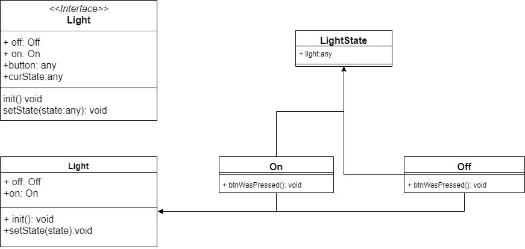

# 状态模式

​		状态模式的关键是区分事物内部的状态,事物内部状态的改变会带来行为的改变

​		把事物的每种状态都封装成单独的类,跟此种状态有关的行为都被封装在这个类的内部

好处:

​		它可以使每种状态和它对应的行为之间的关系局部化,这些行为被分散和封装在各自对应的状态类之中,便于阅读和管理代码

## 开关灯

​		把灯封装成一个类`Light`,灯的`on`,`off`都封装在这个类中,灯的两种状态都是一个类,每种状态和对应的行为都在这个类中

​		当开关被触发,会通过当前的状态类的`btnWasPressed`改变`Light`的状态和触发相应的行为



```js
//light
interface Light{
    off:Off,
    on:On,
    button:any,
    curState:any,
    init():void,
    setState(state:any):void
}

class Light implements Light{
    constructor() {
        this.off=new Off(this);
        this.on = new On(this)
    }
    init(): void {
        let btn = document.createElement('button');
        let self = this;
        this.button = document.body.appendChild(btn);
        this.button.innerHTML = '开关';
        this.curState = this.off;
        this.button.onclick=function () {
            self.curState.btnWasPressed()
        }
    }
    setState(state):void{
        this.curState = state;
    }

}

class LightState {
    light:any;
    constructor(light:any){
        this.light = light
    }
}

class Off extends LightState {
    constructor(light:any) {
        super(light)
    }
    btnWasPressed(): void { 
        console.log('关灯');
        this.light.setState(this.light.on);
    }
}

class On extends LightState {
    constructor(light:any) {
        super(light)
    }
    btnWasPressed(): void {
        console.log(this.light);
        console.log('开灯');
        this.light.setState(this.light.off);
    }
}

let light = new Light();
light.init()

```

优缺点:

​	定义了状态与行为之间的关系,并将他们封装在一个类里,通过增加新的状态类,很容易增加新的状态和转换

​	避免了`Content`无限膨胀,状态切换的逻辑被分布在状态类中,也去掉了`Content`中原本过多的条件分支

​	用对象代替字符串来记录当前状态,使得状态的切换更加一目了然

​	`Content`中的请求动作和状态类中封装的行为可以非常容易地独立变化而互不影响

**优化点:**

1. 创建和销毁:

   如果`state`对象比较大,可以用第一种方式节省内存,这样可以避免创建一些不会用到的对象并及时回收他们,但如果状态的改变很频繁,最好一来是就把这些`state`对象都创建出来,也没有必要销毁他们,因为可能很快将再次用到他们

   - 仅当`state`对象被需要时才创建并随后销毁

   - 开始就创建好所有的状态对象,并且始终不销毁他们

     

**状态模式和策略模式的关系**

​	都封装了一系列的算法或者行为,类图看起来一模一样,但在意图上有很大的不同

**相同点:**

​	都有一个上下文,一些策略或者状态类,上下文把请求委托给这些类来执行

**区别:**

​	策略模式中的各个策略类之间是平等又平行的,它们之间没有任何联系,所以客户必须熟知这些策略类的作用,以便客户可以随时主动切换算法

​	状态模式中,状态和状态对应的行为是早已被封装好的,装填之间的切换也早被规定完成,'改变行为'这件事情发生在状态模式内部,对客户来说,并不需要了解这些细节,这正式状态模式的作用所在

## 状态机

​	`开关`是模拟传统面向对象语言的状态模式实现,为每种状态都定义一个状态子类,然后在`Content`中持有这些状态的引用,以便把`curState`设置为当前的状态对象

​	状态模式是状态机实现之一,JS可以非常方便地使用委托技术,并不需要事先让一个对象持有另一个对象,`Function.prototype.call`方法直接把请求委托给某个字面量对象来执行

```js
class Light {
    constructor(){
        this.curState = Fsm.on;
        this.button = null
    }
    init(){
        let button = document.createElement('button');
        self = this;
        button.innerHTML = '关灯';
        this.button = document.body.appendChild(button);
        this.button.onclick = function () {
        self.curState.btnWasPressed.call(self)
        }
    }
}
//状态机
let FSM = {
    off:{
        btnWasPressed(){
            this.curState = FSM.on
        }
    },
    on:{
        btnWasPressed() {
            this.curState = FSM.off
        }
    }
}

let light = new Light()
light.init()
}
```


​	